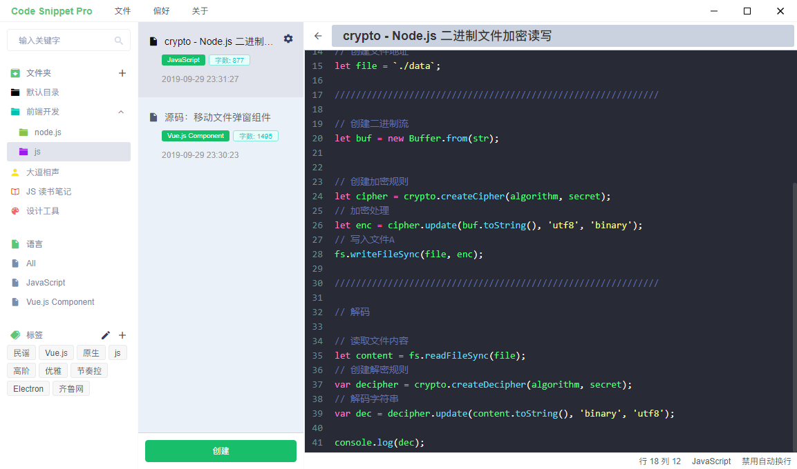
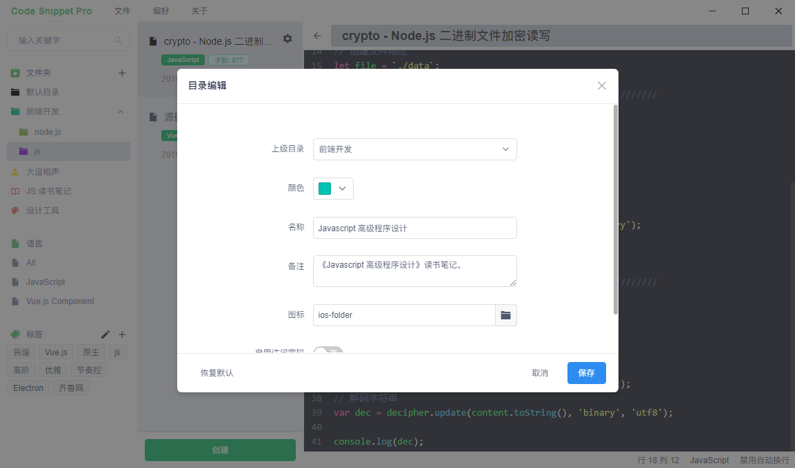
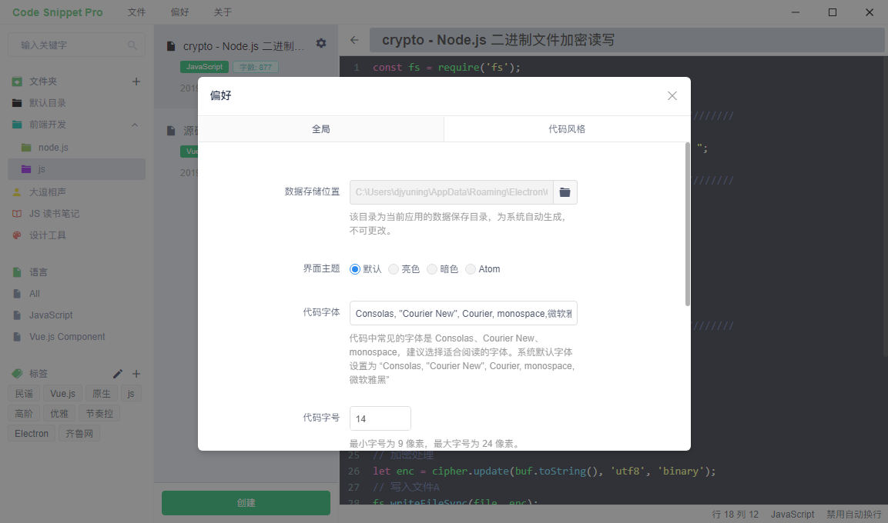
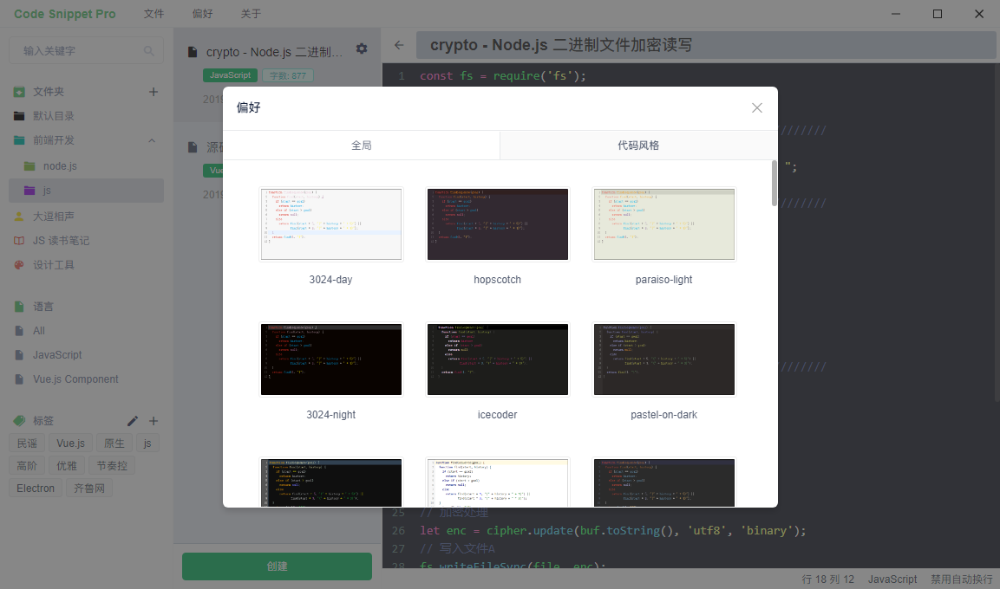
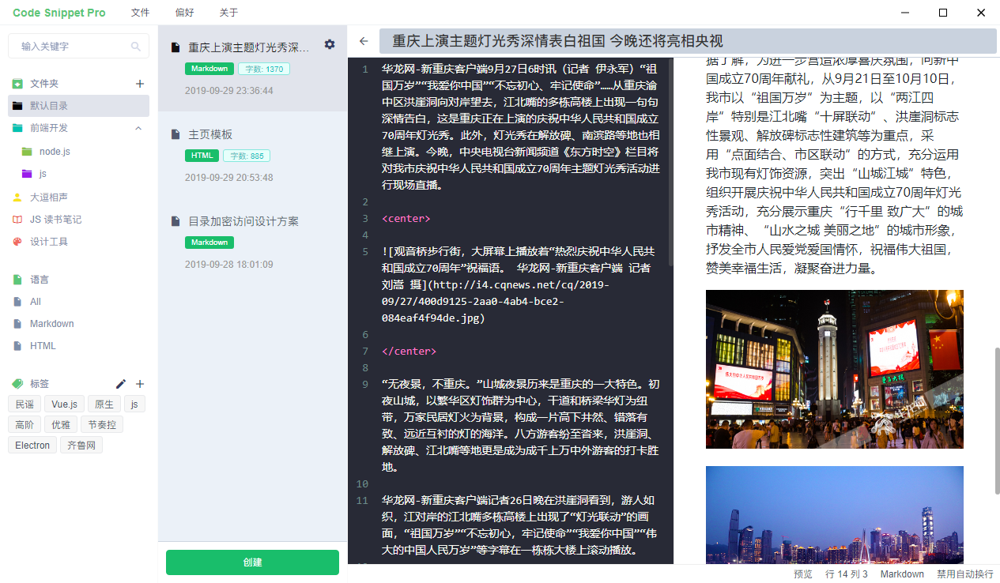

# Code Snippet Pro

> 好记性不如烂笔头

基于 electron 和 Vue.js 开发的一个代码片段管理工具，支持 Windows 和 Mac 系统。

## 截图

|截图|截图|
|:---:|:---:|
|||
|||
|||

## 开发

``` bash
# 安装依赖
npm install
# 或
yarn

# 运行调试开发服务
npm run dev
# 或
yarn dev

# 构建打包
npm run build
# 或
yarn build

# 运行测试
npm test

# 语法检查
npm run lint
```

## 依赖

|包|版本|备注|
|:---:|:---:|:---|
|[vue-electron](https://www.npmjs.com/package/vue-electron)|1.0.6|electron 的 Vue.js 封装|
|[vue-codemirror](https://www.npmjs.com/package/vue-codemirror)|4.0.6|基于 Vue.js 的 codemirror 组件|
|[vue-markdown](https://www.npmjs.com/package/vue-markdown)|2.2.4|基于 Vue.js 的 markdown 渲染组件|
|[moment](https://www.npmjs.com/package/moment)|2.24.0|日期处理|
|[iview](https://www.iviewui.com/)|3.5.0|基于 Vue.js 的 UI 框架|
|[hotkeys-js](https://www.npmjs.com/package/hotkeys-js)|3.1.1|快捷键监听辅助|
|[axios](https://www.npmjs.com/package/axios)|0.18.0|网络请求|
|[uuid](https://www.npmjs.com/package/uuid)|3.3.3|生成 UUID|

## 资源

- [electron 官方文档](https://electronjs.org/docs)
- [codemirror 主题预览](https://codemirror.net/demo/theme.html#3024-night)
- [axios](http://www.axios-js.com/)
- [moment](http://momentjs.cn/)
